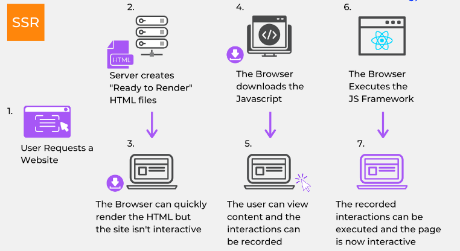

# 랜더링과 리액트

## 랜더링

### SSR(Server Side Rendering)

- 서버 쪽에서 렌더링 준비를 끝마친 상태로 클라이언트에 전달하는 방식
    
    → ex) next, nuxt
    
- 단계
    
    
    
    1. 유저가 웹사이트에 요청을 보냄
    2. 서버가 리소스 체크와 컴파일을 통해 즉시 렌더링이 가능한 완성된 HTMl파일들을 생성
    3. 브라우저가 완성된 HTML 파일을 다운로드 받음. HTML파일이 이미 렌더링이 완료되어 있는 상태이기 때문에 즉시 렌더링이 되지만 JavaScript가 렌더링 되지 않았기 때문에 아직 페이지와의 상호작용은 불가
    4. JavaScript를 다운
    5. 다운로드를 받는 동안 유저는 컨텐츠들을 볼 수 있지만, 조작은 불가능하기 때문에 사용자의 상호작용 시도를 기억해둠
    6. JavaScript 프레임워크를 실행
    7. 이 단계부터 페이지와 상호작용이 가능해지고, 5단계에서 기억해 놓는 사용자의 조작이 실행

### CSR(Client Side Rendering)

- 클라이언트 쪽에서 일어난다.
- 즉, 서버는 요청을 받으면 클라이언트에 HTML과 JS를 보냄.
- 클라이언트는 그것을 받아 렌더링을 시작.
    
    → ex) React, Vue, Angular, Svelte
    
- 단계
    
    
    
    1. 유저가 웹 사이트에 요청을 보낸다.
    2.  CDN이 서버의 데이터들(HTML, JavaScript 등)에 접근할 수 있는 링크를 클라이언트에 보낸다.
    3. 
    4. 해당 링크를 통해 HTML과 JavaScript를 다운로드 받는다. 이 단계에서는 다운로드만 받은 상태이므로 브라우저의 화면에는 아무것도 보이지 않는다.
    5. 다운로드가 완료된 JavaScript가 실행되고, API를 호출한다. 이 단계에서 브라우저 화면에는 데이터가 들어 있지 않은 빈 placeholder들이 표시된다.
    
    6. 서버가 API의 호출에 응답해 데이터를 보낸다.
    
    7. API에서 받아온 데이터들을 placeholder 자리에 넣어준다. 이 단계부터 페이지와 상호작용이 가능해진다.
    

### CSR & SSR 장단점

### 웹페이지 렌더링

- Loading ⇒ Parsing ⇒ Rendering Tree ⇒ Layout ⇒ Paint Composite ⇒ Reflow ⇒ Repaint
    - `Loading` : 로더가 서버로부터 전달 받은 리소스 스트림을 읽는 과정
    - `Parsing` : 웹 엔진의 HTML/XML 파서가 문서를 파싱해 DOM Tree를 CSS파서가 CSSOM 트리를 생성
    - `Rendering Tree` : DOM Tree + CSSOM Tree, 렌더린에 필요한 노드만 선택해 페이지를 렌더링
    - `Layout` : 렌더 트리를 토대로 그려질 노드와 스타일, 크기를 계산
    - `Paint Composite` : 렌더 트리의 각 노드를 실제 픽셀로 변환
    - `Reflow` : 사용자의 다양한 액션으로 인해 영향을 받게 되는 모든 노드에 대해 렌더링 트리 생성과 레이아웃 과정을 다시 수행하게 되는 과정
    - `Repaint` : Reflow의 결과를 화면에 그리기 위한 페인팅 단계

## React

### 특징

- Virtual DOM 사용
- 컴포넌트 컨셉
- One Way Data Flow

### 컴포넌트

- 리액트로 만들어진 앱을 이루는 최소한의 단위
- 컴포넌트는 MVC의 부를 독립적으로 구성하여 재사용을 할 수 있고 이를 통해 새로운 컴포넌트를 쉽게 만듬
- 컴포넌트는 데이터를 입력 받아VIEW 상태에 따라 DOM Node를 출력하는 함수
- 컴포넌트 이름은 항상 대문자로 시작
- UI를 재사용 가능한 개별적인 여러 조각으로 나누고, 각 조각을 합쳐서 사용