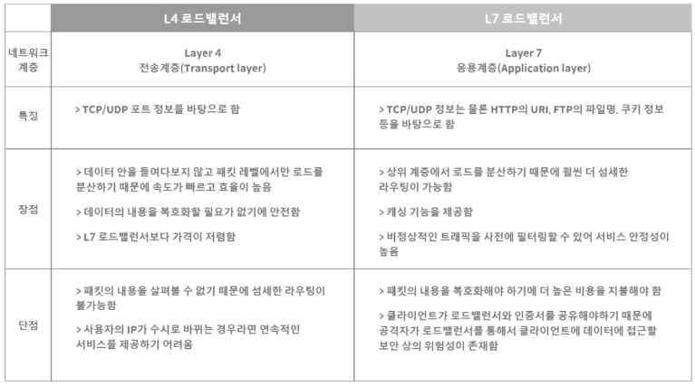

# Front-End 개발 시작해보기 : React 편

# **React**

- Why ~ How
- CRA
- useState
- component
- DataGrid

# **Why?**

- 새로운 언어라는 막연함
- 눈에 안들어오는 코드의 난해함

# **How?**

- CRA(Create React App)
- babel
- webpack

# **설치 및 시작**

- Nodejs설치
    - Node Package Manager(NPM)
- CRA 설치
    - 설치 희망 path 이동
    - ex) C:\Users\vailish\test>npm create-react-app testpjt

# **React문법**

- `{ }`
- { title[0] }과 같이 써주면 인식함

JavaScript 

```
let title = ['이름', '전공']

// 중략
  <tr>
    <th scope="cols">{ title[0] }</th><th scope="cols">{ title[1] }</th>
  </tr>
// 중략
```

# **useState**

- 객체, 대체값
- 버튼 클릭시 요소가 바뀌게 들어가게 할 수 있음(아래 예시)

JavaScript 

```
import { useState } from 'react';
//중략

let [name, nameUpdate] = useState(['존스노우', '에드 스타크'])

// 중략
<button onClick={ () => { nameUpdate(['아리아', '산사'])}}></button>
// 중략
```

# **component**

- component 재사용

JavaScript 

```
// 생략
<tbody>
{
  name.map((n, i) => {
    return (
      <TrComp name={name[i]} major={major[i]}/>
    )
  })
}
</tbody>
// 중략

//component
fuction TrComp(props) {
  return (
    <tr>
      <th scope="row"> { props.name }></th>
      <td>{ props.major }</td>
    </tr>
    )
}

```

# **DataGrid**

JavaScript 

```
import { DataGrid } from '@mui/x-data-grid';
// 중략

const columns = [
  { field : 'id', headerName : '사번', width : 90 },
  { field : 'name', headerName : '이름', width : 90 },
  { field : 'teamNo', headerName : '팀', width : 90 },
  ];

// 중략

return (
  <div className="App">
    <div style ={{ height: 500, width: '100%' }}>
      <DataGrid rows={rows} cloumns={columns}/>
    </div>
  </div>
);
```

# 로드밸런싱

### Scale Up & Scale Out

- scale up
    - 서버가 클라이언트의 응답을 더 빠르고 한꺼번에 많이 처리하기 위해 서버의 사양을 높이는 경우.
    - 성능 자체를 높이는 것
    - 하나의 서버가 한번에 더 많은 응답을 처리할 수 있다.
- Scale Out
    - 클라이언트의 요청을 한 서버가 아닌 여러 서버에게 분산하는 경우
    - 시스템 한 대를 더 추가하는 개념

### Scale Out 장점

- 하나의 서비스에 대해 여러 서버가 가동, 서버 failuer에 대한 안정성을 확보할 수 있음
- 하드웨어 향상 하는 비용보다 서버 한대 추가 비용이 더 적음
- 여러 대의 server 덕분에 무중단 서비스를 제공할 수 있음

### 로드밸런서

- 부하 분산을 위해서 가상 IP를 통해 여러 서버에 접속하도록 분배하는 기능
- 하나의 서비스에 대한 부하를 여러 서버로 분산

### L4/L7 로드 밸런서




### 로드밸런싱 알고리즘

- 정적 로드 밸런싱
    - 고정된 규칙을 따르며 현재 서버 상태와 무관
    - 라운드 로빈 방식
        - 권한 있는 이름 서버가 특수 하드웨어나 소프트웨어 대신 로드 밸런싱을 수행
        - 이름 서버는 서버 팜에 있는 여러 서버의 IP 주소를 차례대로 또는 라운드 로빈 방식으로 반환
    - 가중 기반 라운드 로빈 방식
        - 우선 순위 또는 용량에 따라 각 서버에 서로 다른 가중치를 할당 할 수 있음
        - 가중치가 높은 서버는 이름 서버에서 들어오는 애플리케이션 트래픽을 더 많이 수신
    - IP 해시 방식
        - 로드 밸런서는 클라이언트 IP 주소에 대해 해싱이라고 하는 수학적 계산을 수행
        - 클라이언트 IP 주소를 숫자로 변환한 다음 개별 서버에 매핑
        
- 동적 로드 밸런싱
    - 트래픽을 배포하기 전에 서버의 현재 상태를 검사
    - 최소 연결 방법
        - 로드 밸런서는 활성 연결이 가장 적은 서버를 호가인하고 해당 서버로 트래픽 전송
        - 모든 연결에 모든 서버에 대해 동일한 처리 능력이 필요하다고 가정
    - 가중치 기반 최소 연결 방법
        - 일부 서버가 다른 서버보다 더 많은 활성 연결을 처리 할 수 있다고 가정
        - 각 서버에 다른 가중치 또는 용량을 할당할 수 있으며 로드 밸런서는 용량 별 연결이 가장 적은 서버로 새 클라이언트 요청을 전송
    - 최소 응답 시간 방법
        - 서버 응답 시간과 활성 연결을 결합하여 최상의 서버를 결정
        - 모든 사용자에게 더 빠른 서비스 보장 가능
    - 리소스 기반 방법
        - 현재 서버 부하를 분석하여 트래픽을 배포
        - 해당 서버에 트래픽을 배포하기 전에 에이전트에 충분한 여유 리소스가 있는지 확인