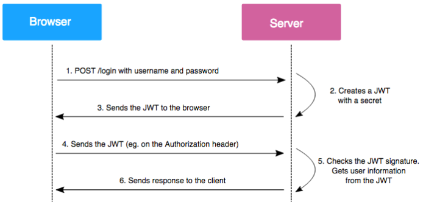

# JWT를 사용하는 이유

### 특징

- Header, Payload, Signature의 구조
- Decode 하면 내용을 읽어낼 수 있다.
- Header, Payload, Signature로 이루어짐
    - Header : 토큰의 타입과 해시 암호화 알고리즘으로 구성
    - Payload : 토큰에서 사용할 정보의 조각들인 클레임이 담겨져 있음.
    - Signature : Token을 인코딩하거나 유효성 검증을 할 때 사용하는 고유한 암호화 코드
- Self-contained한 속성을 가지고 있음
    - JWT가 스스로 인증에 필요한 데이터를 가지고 있다.
- 모바일 환경에서 다시 로그인 할 필요가 없다
- Stateless 함
    - 세션과는 다르게 백엔드 서버가 바뀌어도 인증 가능하다
    - Stateless의 장점
        - Scale out 하더라도 대응이 가능
        - 비밀번호를 다시 입력할 필요가 없음
        - Validation check만으로도 검증이 가능
        - 그럼에도 불구하고 white list 방식의 추가 검증을 하는 경우가 있음
            
            ⇒ Validation만으로도 안정성을 보장 받는 것이 어렵기 때문
            

### JWT 동작 과정

1. Browser 가 Server에 POST 방식으로 로그인 요청
2. Server에서 JWT를 생성
3. Server에서 생성된 JWT를 Browser에게 반환
4. 이후 Browser는 Server에 요청할 때 발급 받은 JWT를 함께 보냄
5. Server에서 JWT에 포함된 Signature를 확인하고 JWT에서 사용자 정보를 꺼내 사용
6. Browser에게 응답을 보냄

### Access token && Refresh token

- Jwt는 Access token과 Refresh token 2개의 토큰을 사용
- Access token 은 짧게, Refresh token 은 보다 긴 생명 주기를 갖는다

### Refresh token의 필요 이유

- Access token만을 사용할 경우 제 3자에게 탈취당한다면 보안에 취약하다는 단점이 있음
    
    ⇒ 공격자는 사용자와 동일한 권한을 갖기 때문에 권한 접근이 가능해지게 
    
- 따라서 Access token의 유효기간을 짧게 설정하고, Refresh token을 이용해 재발급이 가능하게끔 함

### Access token & Refresh token 재발급 원리

1. 로그인 시 Access token과 Refresh token을 모두 발급
    - Refresh token만 서버측 DB에 저장
    - Refresh token 과 Access token을 쿠키 또는 웹스토리지에 저장
2. 사용자가 인증에 필요한 API에 접근 시 가장 먼저 토큰을 검사
    - Access token 과 Refresh token이 모두 만료
        - 에러 발생 ⇒ 다시 로그인하여 재발급
    - Access token을 만료, Refresh token은 유효
        - Refresh token을 검증하여 access token 재발급
        - 클라이언트(쿠키, 웹스토리지)에 저장되어있는 Refresh token과 서버 DB에 있는 Refresh token 일치성 확인 후 발급
    - Access token은 유효, Refresh token은 만료
        - Access token을 검증하여 Refresh token 재발급
        - Access token이 유효하다는 것은 이미 인증된 것과 마찬가지이므로 바로 Refresh token을 재발
    - Access token & Refresh token이 둘다 유효
        - 정상처리
        

### Refresh token 인증 과정

1. 사용자가 로그인
2. 서버에서는 회원 DB에서 값을 비교
3. 로그인이 완료되면 Access token, Refresh token을 발급 후 DB에 Refresh token 저장
4. 3과 동일
5. 사용자는 Refresh token은 안전한 저장소에 저장 후, 다른 요청 시 access token을 실어 요청 보냄
6. Access token을 검증하여 이에 맞는 데이터 보냄
7. 6과 동일
8. 시간이 지나 Access token이 만료됨
9. 사용자는 이전과 동일하게 Access token을 헤더에 실어 요청 보냄
10. 서버는 Access token이 만료됨을 확인하고 권한없음을 보냄
11. 10과 동일
12. 사용자는 Refresh token과 Access token을 함께 서버로 보냄
13. 서버는 받은 Access token이 조작되지 않는지 확인후 Refresh token을 DB에 저장된 Refresh token과 비교 후 재발급 진행
14. 서버는 새로운 Access token을 헤더에 실어 다시 요청 보냄
- Access Token 이 만료될 때마다 9~11 과정을 거칠 필요 없음
- Front에서 Access token의 Payload를 통해 유효기간을 알수 있기 때문에 API 요청 전에 토큰이 만료되었다면 곧바로 재발급 요청을 할 수 있음