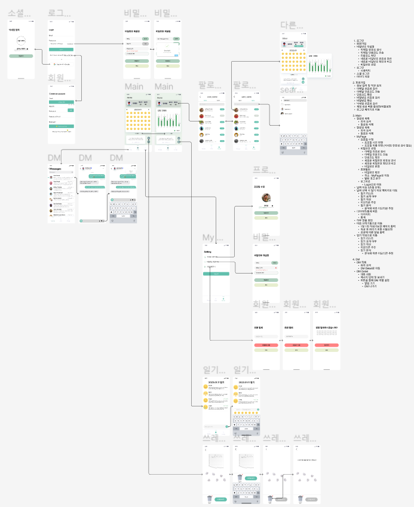

# Day 01/17

## To Do List
:white_check_mark: 유튜브 라이브 강의 : Front-End 개발 시작해보기 : React 및 2주차 News  
:white_check_mark: 로드밸런서  
:white_check_mark: 스토리보드 초안 작성  

--------
## React 및 2주차 News
**Why?**

## 로드밸런서
**Scake-up**
- 서버가 클라이언트이 응답을 더 빠르고 한꺼번에 많이 처리하기 위해 서버의 사양을 높이는 경우, 성능 자체를 높이는 것, 하나의 서버가 한번에 더 많은 응답을 처리할 수 있다
**Scale- out**
- 클라이언트의 요청을 한 서버가 아닌 여러 서버에게 분산하는 경우, 시스템 한 대를 더 추가하는 개념
- Scake-Out의 장점
    - 하나의 서비스에 대해 여러 서버가 가동, 서버 failure에 대한 안전성을 확보할 수 있음 (failover)
    - 하드웨어 향상하는 비용보다 서버 한대 추가 비용이 더 적음
    - 여러대의 서버 덕분에 무중단 서비스를 제공할 수 있음

**로드밸런서**
- 부하 분산을 위해서 가상(virtual) IP를 통해 여러 서버에 적속하도록 분배하는 기능
- 하나의 서비스에 대한 부하를 여러 서버로 분산

**L4/L7 로드밸런서 차이**

- L4 로드밸런서

- L7 로드밸런서

**로드밸런서 알고리즘**
- 정적 로드 밸런싱
    - 라운드 로빈 방식
    - IP 해시 방식
- 동적 로드 밸런싱
    - 최소 연결 방식
    - 가중 라운드로빈 방식

--------
## 스토리보드 초안 작성

