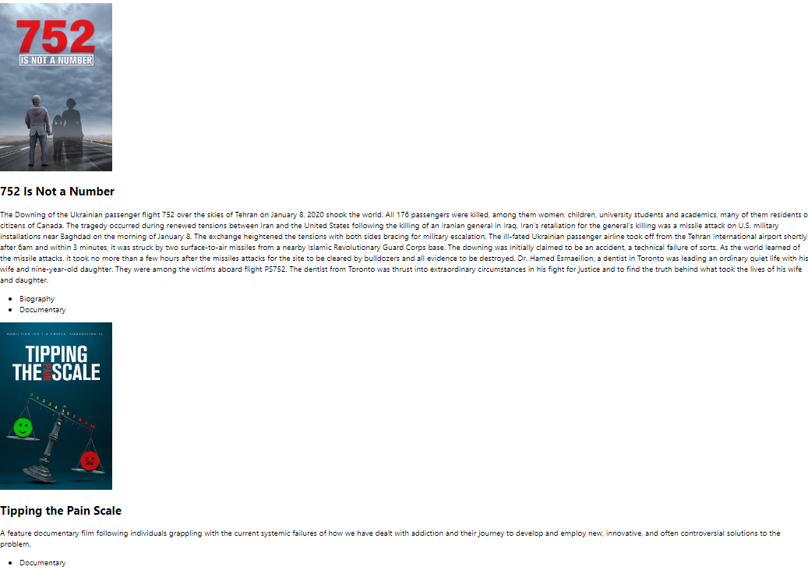

# Day 01/18

## To Do List
:white_check_mark: 유튜브 라이브 강의 - Front-End 개발 시작해보기 : Flutter  
:white_check_mark: JWT를 사용하는 이유  
:white_check_mark: React 학습  

--------
## JWT를 사용하는 이유
**JWT (json web token)**

**JWT의 특징**
- Header, Payload, Signiture의 구조
- Decode하면 내용을 읽어낼 수 있다
- Header에는 알고리즘과 타입, Payload에는 데이터를 담고 Signiture를 이용해서 검증한다
- 당연한 이야기만 Payload에 노출될 수 있는 정보 담는 것 주의

**JWT를 왜 사용하는가?**
- self-contained한 속성을 가지고 있음
    - JWT 스스로 인증에 필요한 데이터를 가지고 있음
- Stateless
    - 세션과는 다르게 백엔드 서버가 바뀌어도 인증가능
- 모바일 환경에서 다시 로그인 할 필요가 없음

**Stateless의 장점**
- scale out을 하더라도 대응이 가능
- 비밀번호를 다시 입력할 필요가 없음
- validation check만으로 검증 가능
    - 그럼에도 불구하고 whitelist 방식의 추가 검증을 하는 경우도 있음

**Access token과 refresh token**

-------
## React 학습
- loading 중 화면  

- 데이터 받아온 화면  
